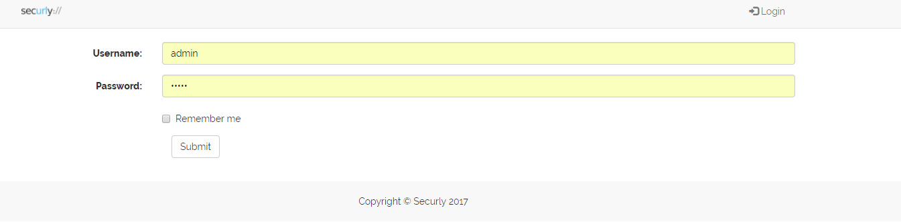
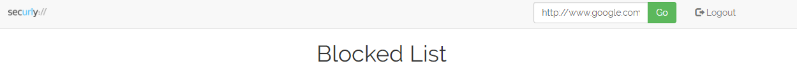
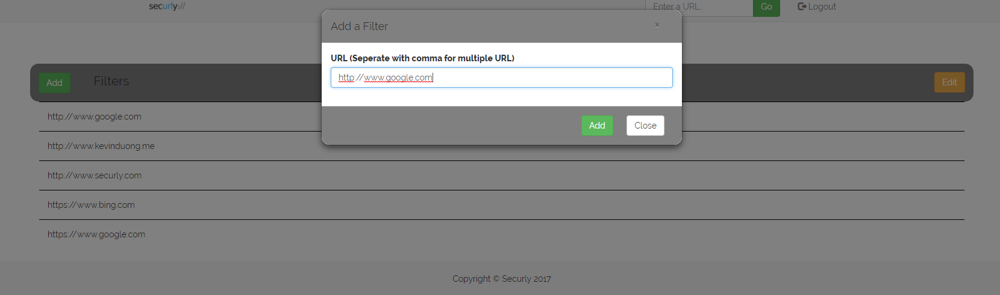
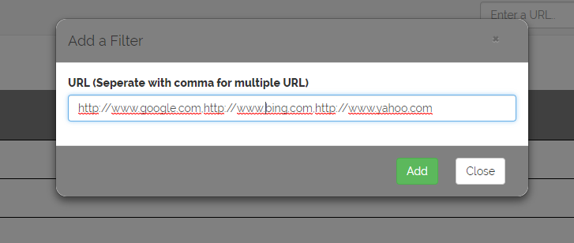
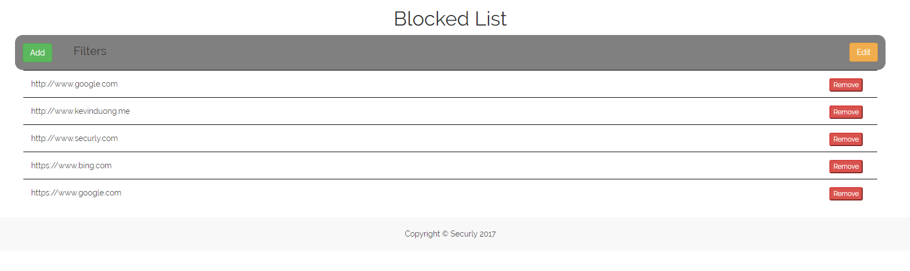

Basic Web Filter
==============
Demo can be found at http://www.kevinduong.me/phpbuild  (should also be mobile friendly)

### Login Information ###
To login to the web filter, you must login with the hardcoded login information. (User: admin; Pass: admin)

### Login Information ###
To logout, click on the logout button in the navbar.

### Adding an URL ###
To add a url, click on the add button and enter the full url in the input box.

### Adding Multiple URL ###

To add multiple url, click on the add button and enter the urls in the input box seperated with a comma.

(i.e http://www.google.com,http://www.bing.com)

### Deleting URL ###

To delete a url, click on the edit button. This will toggle remove buttons for each item in the list. Click remove on the url you wish to remove.

### Opening URL ###
To open a url, enter a url on the navbar. Press go after finishing entering the url. This will open up an iframe in a modal. The iframe will show "blocked" in red text if the url is in the blocked list. (Iframe will show blank for some sites that do not allow iframes)

